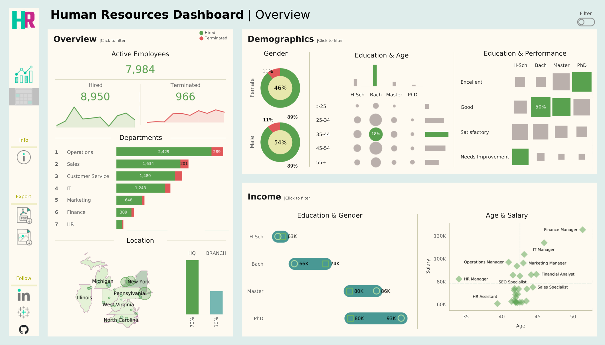

# Human Resources Dashboard | Tableau


An interactive HR analytics dashboard built in Tableau that provides high-level workforce insights across employee overview, demographics, and income analysis — designed to support data-driven decision-making for HR managers.



> 🔗 **[View Live Dashboard on Tableau Public](https://public.tableau.com/app/profile/shubham.ghode/viz/hr_analytics_dashboard_17716884634530/HRSummary)**

---

## Problem Statement

**As an HR manager**, a comprehensive dashboard is needed to analyze human resources data that provides a summary view for high-level insights, enabling quick identification of workforce trends, demographic composition, and compensation patterns across the organization.

---

## Dataset

The dataset was **synthetically generated** using a Python script (powered by the `Faker` library) to simulate a realistic HR dataset of **8,950 employee records** with 16 attributes.

<details>
<summary><b>Click to expand dataset attributes</b></summary>

| # | Attribute | Description |
|---|-----------|-------------|
| 1 | Employee ID | Unique identifier |
| 2 | First Name | Randomly generated |
| 3 | Last Name | Randomly generated |
| 4 | Gender | 46% Female, 54% Male distribution |
| 5 | State & City | From predefined U.S. locations |
| 6 | Hire Date | Custom year probabilities (2015–2024) |
| 7 | Department | 7 departments with weighted probabilities |
| 8 | Job Title | Role-specific within each department |
| 9 | Education Level | Mapped to job title requirements |
| 10 | Performance Rating | Excellent, Good, Satisfactory, Needs Improvement |
| 11 | Overtime | 30% Yes, 70% No |
| 12 | Salary | Range-based on department and job title |
| 13 | Birth Date | Age-group distribution aligned with hire date |
| 14 | Termination Date | 11.2% attrition rate with yearly probabilities |
| 15 | Adjusted Salary | Modified by gender, education, and age multipliers |

</details>

The data generation script and prompts used are included in the repository for full reproducibility.

---

## Dashboard Overview

The summary dashboard is organized into three analytical sections:

### 1. Overview
- **KPI Cards** — Total hired (8,950), active (7,984), and terminated (966) employees
- **Hiring & Termination Trends** — Year-over-year line chart tracking workforce changes
- **Department Breakdown** — Ranked horizontal bars showing headcount and terminations per department
- **HQ vs. Branch Split** — Geographic distribution across states with 70% HQ (New York) and 30% branches

### 2. Demographics
- **Gender Ratio** — Donut charts showing 46% Female / 54% Male composition
- **Education & Age Distribution** — Bubble matrix correlating education levels (H-Sch, Bachelor, Master, PhD) with age groups (< 25 to 55+)
- **Education & Performance** — Heatmap revealing the relationship between educational background and performance ratings

### 3. Income Analysis
- **Education & Gender Pay Comparison** — Side-by-side salary comparison across education levels segmented by gender
- **Age & Salary Correlation** — Scatter plot mapping average age vs. salary by job title within departments

---

## Tools & Technologies

| Tool | Purpose |
|------|---------|
| **Tableau Desktop** | Dashboard design and visualization |
| **Tableau Public** | Publishing and sharing |
| **Python (Faker)** | Synthetic dataset generation |
| **ChatGPT** | Data generation script development |

---

## Key Insights

- **Operations** is the largest department (2,429 employees) and also has the highest termination count (289), suggesting potential retention challenges at scale.
- Employees with **PhD-level education** earn significantly more ($80K–$93K) compared to high school graduates ($63K), with the pay gap widening across education tiers.
- The **35–44 age group** with a Bachelor's degree has the highest concentration of employees (18%), indicating a mid-career-heavy workforce.
- **Gender pay disparity** is visible at the Bachelor's level ($66K Female vs. $74K Male) but narrows at higher education levels.
- **50% of Bachelor's degree holders** received a "Good" performance rating — the highest concentration in the Education & Performance matrix.

---
## Getting Started

1. **Clone the repository**
   ```bash
   git clone https://github.com/SVG3256/tableau-hr-dashboard.git
   ```
2. **Open the Tableau workbook** — Open `hr_analytics_dashboard.twbx` in Tableau Desktop or Tableau Public
3. **Explore** — Use the interactive filters on each section (click to filter on Overview, Demographics, and Income panels)

---

## Acknowledgements

- **[Project Materials](https://www.datawithbaraa.com/wiki/tableau#tableau-hr-project)** — Dataset, icons, and resources

---

## Connect

[](https://linkedin.com/in/shubham-ghode/)
[](https://shubhamghode.vercel.app/)
[](mailto:shubhamvghode@gmail.com)